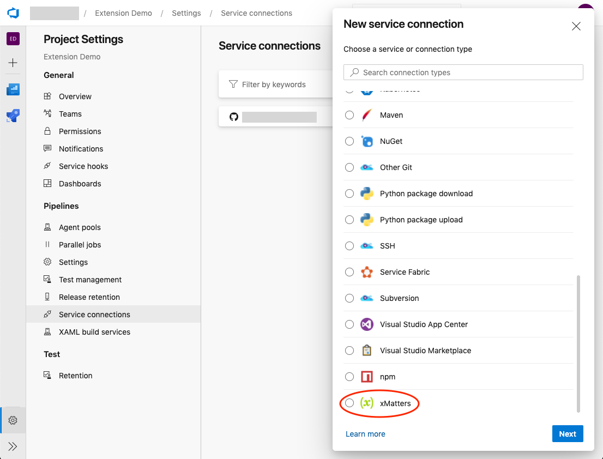
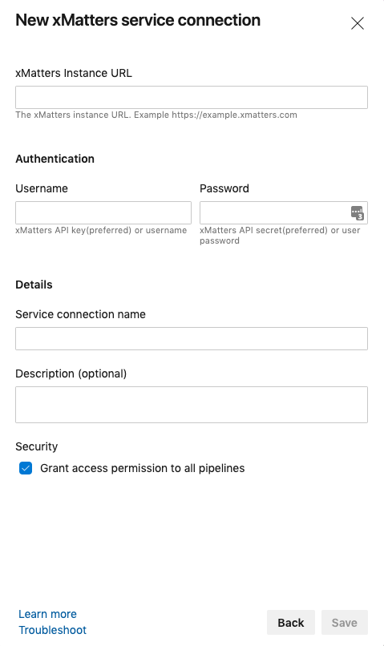
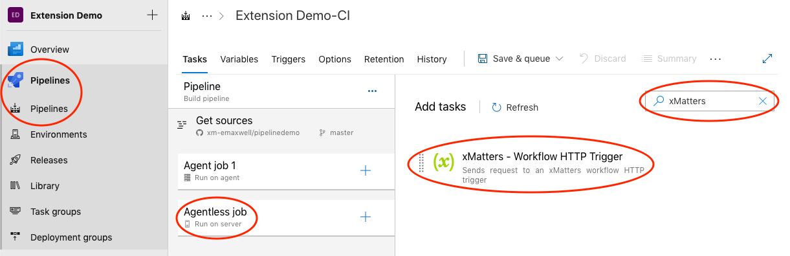
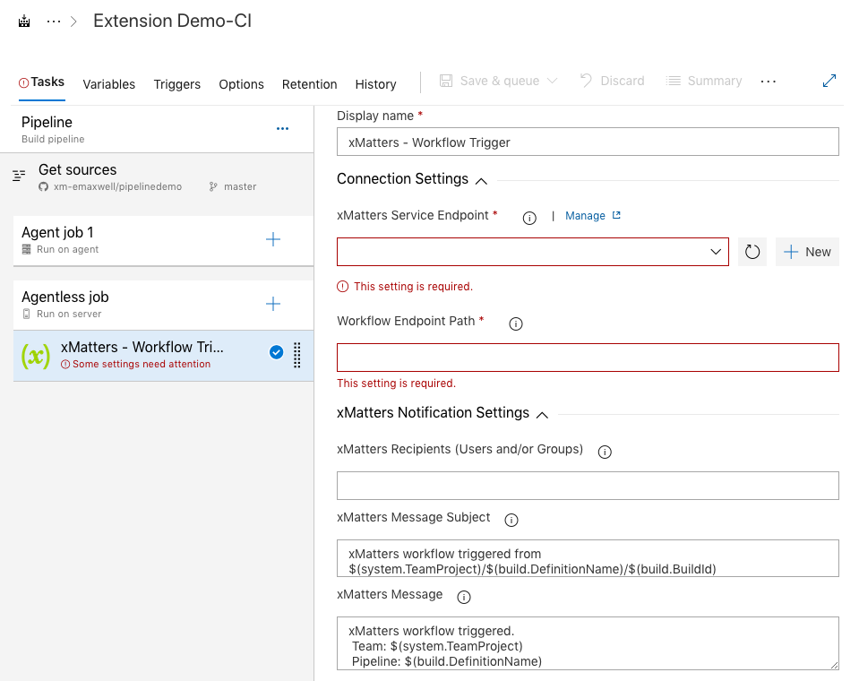
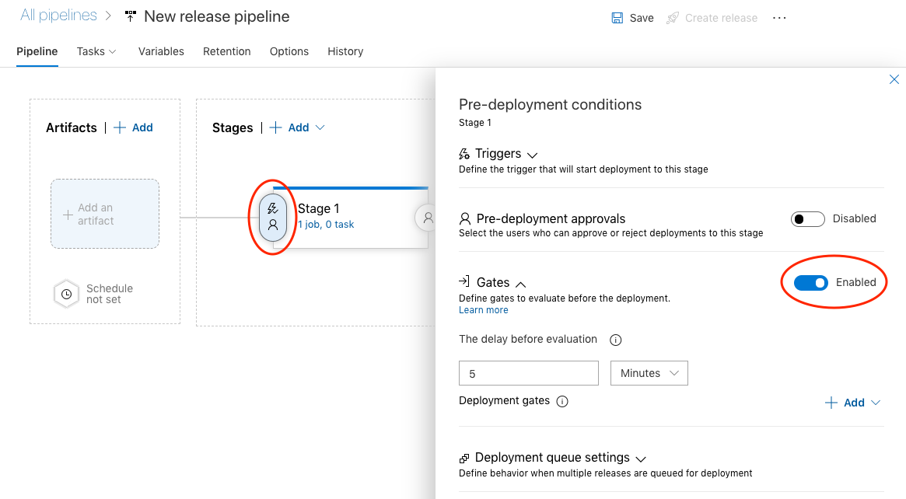
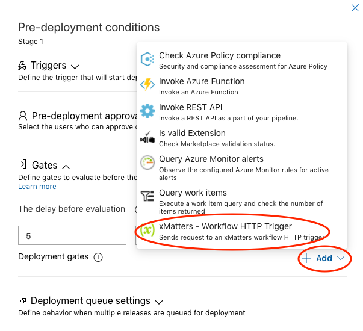
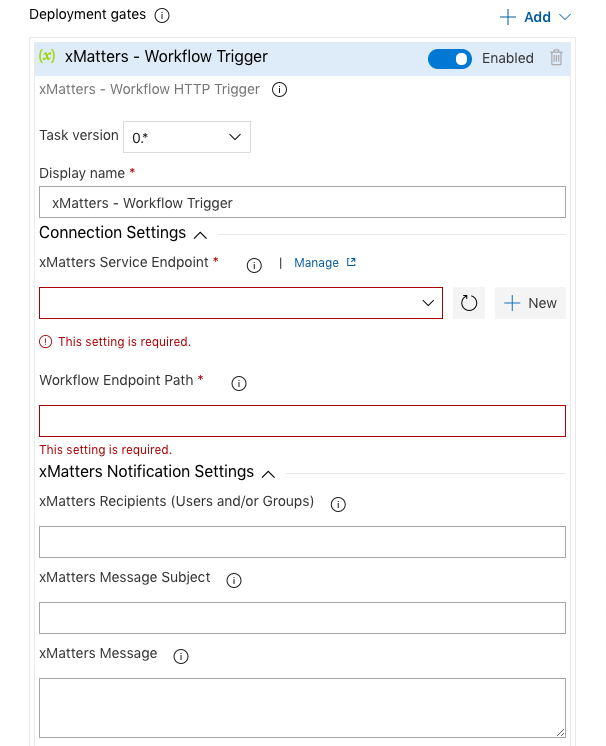

# xMatters - Azure DevOps Extension
This is an example Azure DevOps extension that can be built and installed into your Azure DevOps organization to make configuring integrations with xMatters easier.

### :scroll: DISCLAIMER
<kbd>
    
</kbd>

#### :blue_book: NOTE
> At the time of writing this xMatters does not have an official Azure DevOps extension. So before going through this you may want to verify there is not one available on the Azure Devops [marketplace](https://marketplace.visualstudio.com/azuredevops).

---
# Summary
This extension will add a xMatters service connection type, pipeline task, and release gate. They work in conjunction with the Azure DevOps Pipelines example workflow.

The same functionality can be acheived just using a Generic service connection and the Invoke REST API task in Azure DevOps. This extension was created to possibly make it a little easier to maintain these configurations.

This is a very basic extension, so there is no validation of user input and such.

# Documentation
These instructions are intend to be a summary of how to build and deploy an Azure DevOps extension. They will point out some of the specific modifications you can make for your use case. You can view Microsoft's documentation to get more detail. Below are links to information I used to create this extension.

#### :blue_book: NOTE
> These external links may not be maintained in this readme, so they could become invalid

* [Develop a web extension for Azure DevOps Services](https://docs.microsoft.com/en-us/azure/devops/extend/get-started/node?view=azure-devops) - explains how to setup, create, build, and deploy an extension.
* [Source for InvokeRESTAPI](https://github.com/microsoft/azure-pipelines-tasks/blob/master/Tasks/InvokeRestApiV1/task.json) - I mimicked my task after this.
* [Azure DevOps Extension Tasks](https://marketplace.visualstudio.com/items?itemName=ms-devlabs.vsts-developer-tools-build-tasks) - nice extension for Azure DevOps to create a CI/CD pipeline for your Azure DevOps extension development.

## Build and Publish Extension
The instructions in this section are refering to the document located at [Develop a web extension for Azure DevOps Services](https://docs.microsoft.com/en-us/azure/devops/extend/get-started/node?view=azure-devops).

1. Follow the instructions in the **Prerequisites** section to setup your local build environment.

2. You can **skip** the **Create a directory and manifest** section and just clone this directory [xm-extension](AzureDevOps/src/xm-extension).

3. Now go to the **Package and publish your extension** section and follow the instructions for setting up your publisher in the Visual Studio Marketplace.

4. Once you have your publisher you can open the **vss-extension.json** in this repo and modify the **id** and **publisher** as described in the **Package and publish your extension**.

5. Continue following the instructions in **Package and publish your extension** to build and upload your extension to the marketplace. If you follow the instructions it will be private.

6. Finally follow **Install your extension** instructions to share your extension with your organizations.

## Verify Components Installed
We will now verify the components are showing up in your Azure DevOps organization. I assume you are familiar with Azure DevOps. There should be 3 new components.
* Service Connection type called "xMatters"
* Pipeline Task called "xMatters - Workflow HTTP Trigger"
* Release Gate called "xMatters - Workflow HTTP Trigger"

### Service Connection
These instructions verify the xMatters service connection type shows up after extension installation.

1. Open one of your Azure DevOps project's settings and go to **Service Connections** and select **New service connection**

2. Scroll down the list and verify that the **xMatters** extension type shows up.

    <kbd>
       
    </kbd>

3. You can select it and click **Next** to verify it looks similiar to below.

    <kbd>
       
    </kbd>

### Pipeline Task
We will now verify the xMatters pipeline task shows up after extension installation. They go through creating a new pipeline, but you will not save it.

1. Open an Azure DevOps project and go to **Pipelines** menu and open **Pipelines** option.
2. For verification purposes create a new pipeline and at the bottom select **Use the classic editor**
3. Select any repo *(we are not actually going to save the pipeline)*, but select one that does not contain a pipeline yaml config.
4. Create an empty job by selecting **Empty job** at the top.
5. Add an agentless job to the pipeline
6. Then add a task to the agentless job
7. In the Add tasks search enter **xMatters** and you should see the **xMatters - Workflow HTTP Trigger** task.

    <kbd>
       
    </kbd>

8. You can add the task and then select it to verify the parameters.
    * **xMatters Service Endpoint** - this will be an Azure DevOps Service Connection of the xMatters type. You must create one before anything will show up here.
    * **Workflow Endpoint Path** - this will be the path portion of the HTTP Trigger in your xMatters flow.
    * **xMatters Recipients** - (Optional) - Allows you to configure xMatters users/groups to use in your flow for sending notifications and such. This value can always be set directly in xMatters, but this allows the reuse of an xMatters flow and allowing customization of notification recipients.
    * **xMatters Message Subject** - (Optional) - Allows you to set a subject for an xMatters notification.  This value can always be set directly in xMatters, but this allows the reuse of an xMatters flow and allowing customization of the notification.
    * **xMatters Message** - (Optional) - Allows you to set a message for an xMatters notification.  This value can always be set directly in xMatters, but this allows the reuse of an xMatters flow and allowing customozation of the notification.

     
    <kbd>
       
    </kbd>

9. We are done. If you created a test pipeline you can just close and not save it.

### Release Gate
We are now going to verify the xMatters release gate shows up after extension installation. They go through creating a new release pipeline, but you will not save it.

1. Open an Azure DevOps project and go to **Pipelines** menu and open **Releases** option.
2. Create a new release pipeline.
3. Select **Empty job** at the top and then close the stage window.
4. Now select the **Pre-deployment conditions** and enable **Gates**

    <kbd>
       
    </kbd>

5. Now select **Add** and verify that the **xMatters - Workflow HTTP Trigger** gate shows up.

    <kbd>
       
    </kbd>
  
6. You can add it and verify the parameters.
    * **xMatters Service Endpoint** - this will be an Azure DevOps Service Connection of the xMatters type. You must create one before anything will show up here.
    * **Workflow Endpoint Path** - this will be the path portion of the HTTP Trigger in your xMatters flow.
    * **xMatters Recipients** - (Optional) - Allows you to configure xMatters users/groups to use in your flow for sending notifications and such. This value can always be set directly in xMatters, but this allows the reuse of an xMatters flow and allowing customization of notification recipients.
    * **xMatters Message Subject** - (Optional) - Allows you to set a subject for an xMatters notification.  This value can always be set directly in xMatters, but this allows the reuse of an xMatters flow and allowing customization of the notification.
    * **xMatters Message** - (Optional) - Allows you to set a message for an xMatters notification.  This value can always be set directly in xMatters, but this allows the reuse of an xMatters flow and allowing customozation of the notification.

     
    <kbd>
       
    </kbd>

7. We are done.  If you created a test release pipeline you can just cloase and not save it.

# Modification
These components are very basic and use no validation. If you are familiar with Azure DevOps extensions you can make these much more sophisticated, but below are a few things you can modify fairly easily.

#### :blue_book: NOTE
> * If you have installed the extension and then make modifications the extension manager will require you to increase your extension version number to upload the update. It will not warn you about increasing the task version numbers. If you modify a task and you do not increase the task version number the changes will not show up (unless you uninstall/reinstall the extension).
>
> * I found for basic auth service connections username and password fields the name and id must be "username" and "password".  If you change this it will create new fields called "username" and "password" in the background.

### Field Labels, Descriptions, and Help Text
If you do not like the field labels, descriptions, or help text that is easily updated in the vss-extention.json and the task.json files.  It depends on what you want to change.
* Service connection is defined in the vss-extension.json file
* The pipeline task and release gate are referenced in the vss-extension.json, but are defined in thier respective task.json files.

### Payload - Pipeline Task and Release Gate 
The pipeline task and release gate payload body can be modified. Keep in mind they are setup to work with the triggers supplied with the Azure DevOps Pipeline example workflow. If you remove fields or change the JSON format you may have to modify these triggers.

### Configuration Inputs - Pipeline Task and Release Gate 
You can add configuration inputs to the pipeline task and release gate.  These inputs could be passed in the payload to xMatters. You can see an example of this with the xmRecipients, xmSubject, and xmMessage fields.

### WaitForCompletion - Pipeline Task and Release Gate 
If you review the pipeline task and release gate configuration you will see in the request to xMatters there is a parameter called **WaitForCompletion** this maps to the "Completion event" field in the Invoke REST API. I have them set to true which requires a callback from xMatters to update the status.  If you change to false it will pass based on the response xMatters sends back to the initial request.

You could change this to what you like or even add a field to set it when configuring the task or gate similar to the Invoke REST API task/gate.

The **Expression** field is where the expression is defined for the success criteria if you set WaitForCompletion to false.  It maps to the "Success criteria" field in Invoke REST API.