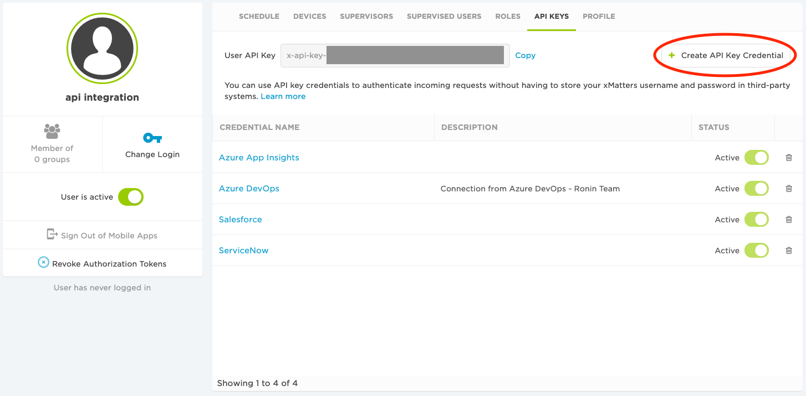
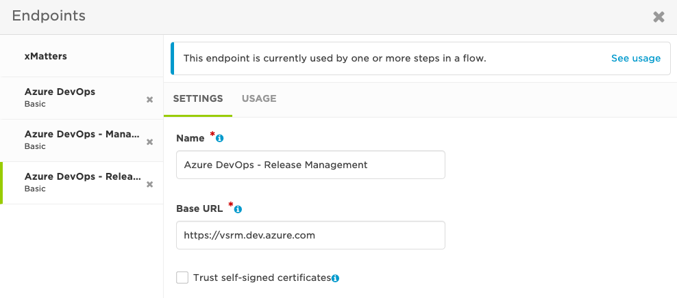

# Azure DevOps - Pipelines
This is a two-way integration with Azure DevOps Pipelines that provides several differnt interactions. The first allows you to trigger a pipeline from xMatters. You can also have Azure DevOps trigger xMatters from a pipeline task or release gate. In these cases there are xMatters steps to reply if the task or gate passed or failed.

### :scroll: DISCLAIMER
<kbd>
  
</kbd>

---
# Pre-Requisites
* Azure DevOps
    * Azure DevOps Services account
    * Permission to setup Service Connections
    * Permission to setup/modify pipelines and releases
* xMatters
    * Account - if you don't have one [get one](https://www.xmatters.com) for free
    * Permissions to create/edit Workflows

---
## Files
* xMatters
    * Workflows
        * [AzureDevOpsPipelines.zip](xMatters/workflows/AzureDevOpsPipelines.zip) - example workflow containing all the triggers and steps
    * Triggers
        * [buildTask.js](xMatters/src/triggers/buildTask.js) - source for trigger to recieve pipeline task notifications
        * [releaseGate.js](xMatters/src/triggers/releaseGate.js) - source for trigger to recieve release gate notifications
    * Steps
        * [queueBuild.js](xMatters/src/steps/queueBuild.js) - source for step that can trigger a pipeline
        * [buildTaskStarted.js](xMatters/src/steps/buildTaskStarted.js) - source for step to notify that the pipeline task has started
        * [buildTaskComplete.js](xMatters/src/steps/buildTaskComplete.js) - source for step to notify that the pipeline task has completed and its result
        * [updateReleaseGate.js](xMatters/src/steps/updateReleaseGate.js) - source for step to update the release gate status
        * [checkResponseCount.js](xMatters/src/steps/checkResponseCounts.js) - source for step that checks if the response count meets the configured response threshold for an xMatters event. **Used in the release gate example**
    * Shared Libraries
        * [base64.js](xMatters/src/shared libraries/base64.js) - source for library used by some of the steps to encode the callback authentication token
* Azure DevOps
    * [InvokeRESTAPI_taskPayload.json](AzureDevOps/src/InvokeRESTAPI_taskPayload.json) - body to use with the "Invoke REST API" pipeline task
    * [InvokeRESTAPI_gatePayload.json](AzureDevOps/src/InvokeRESTAPI_gatePayload.json) - body to use with the "Invoke REST API" gate task
    * [azure-pipelines.yml](AzureDevOps/src/azure-pipelines.yml) - an example pipeline yaml config that can be used to setup the demo

---
# How It Works
### Start a Pipeline
You can use the ***Azure DevOps - Queue Build*** step to start the configured pipeline. The example flow is triggered by an xMatters event being created, but the trigger could be anything you like. For example if you use Azure DevOps for operational management if xMatters received a notification of an application issue your flow could trigger an Azure DevOps pipeline that restarts a service.

### Trigger xMatters from a Pipeline
Using the Azure DevOps Invoke REST API task to send a notification to the ***Azure DevOps - Build Task*** trigger we can start an xMatters flow. You can also configure the Azure DevOps Invoke REST API task to implement a callback and in this case you can use the ***Azure DevOps - Build Task Started*** and ***Azure DevOps - Build Task Completed*** steps to update the build task status.

#### :blue_book: NOTE
> * **Invoke REST API (ApiResponse)** - If you configure the Azure DevOps Invoke REST API task's *Completion event* for ApiResponse it will trigger the xMatters flow, but it will continue on a successful response from the request. Use this when you want to trigger xMatters but do not care the outcome of the xMatters flow. In this case if you use the *Build Task Started* and *Build Task Completed* steps in your flow they will fail because the task will not exist for the callback.
>
> * **Invoke REST API (Callback)** - [Examle uses this] If you configure the Azure DevOps Invoke REST API task's *Completion event* for Callback it will trigger the xMatters flow and wait for a callback containing the task status. Use this when you want the task status to reflect the xMatters flow outcome.

### Trigger xMatters from a Release Gate
Using the Azure DevOps Invoke REST API task as a release gate you can send a notification to the ***Azure DevOps - Release Gate***. In conjunction with the ***Azure DevOps - Update Release Gate*** step you can then update from your flow if the release gate succeeded or failed.

#### :blue_book: NOTE
> * Azure DevOps release gates use a polling mechanism to check the status of the gates. With each poll the callback information changes, so the flow must handle this and be able to respond with the correct callback information.
> * As Azure DevOps polls through the gates it is waiting for all to succeed. It will not continue on until all gates succeed, so if the workflow sends a fail to the gate the release pipeline will not move on but it will continue to run until the gate failure timeout is reached.  This is true for all gates.
> * In most cases when using the Invoke REST API task with a release gate you will want to configure its *Completion event* to Callback or the gate will pass on successful reponse from the trigger request to xMatters. It will not wait for the xMatters flow to update the gate status.

---
# Installation
## xMatters - Setup Inbound Trigger
#### :blue_book: NOTE
> If you do not already have an xMatters user specifically for integrations it is recommended to create one. This account should only be used for integrations and not need web login permissions. 
#### :warning: WARNING
> If the account you choose to use for this integration is removed or made inactive then the integration will break.

1. Under this integration user create a new API key to use with Azure DevOps. [Instructions](https://help.xmatters.com/ondemand/user/apikeys.htm)
    > :pencil2: *Make sure to note the key and secret for later when we configure Azure DevOps.*

    <kbd>
        
    </kbd>

2. Import the example workflow. [Instructions](https://help.xmatters.com/ondemand/xmodwelcome/workflows/manage-workflows.htm)

    <kbd>
        
    </kbd>

3.  Modify the **Build Task** and **Release Gate** form in the imported workflow and give the integration user sender permissions on the form. [Instructions](https://help.xmatters.com/ondemand/xmodwelcome/communicationplanbuilder/formpermissions.htm)

    <kbd>
        
    </kbd>

4. Modify the **Queue Build** form and select the **Enable in Web UI** and **Enable in Mobile App** options.  Also update the sender permissions for this form, but give an actual user permissions. You will later login to xMatters with this account to trigger the flow and the user needs sender permissions on the form. [Instructions](https://help.xmatters.com/ondemand/xmodwelcome/communicationplanbuilder/formpermissions.htm)

    <kbd>
        
    </kbd>

5. Now open the flow **Build Task** and you will see a trigger at the top of the canvas called "**Build Task - Azure DevOps - Build Task**". Hover over the trigger step and select edit.

    <kbd>
        
    </kbd>

6. On the Settings tab copy the trigger's URL and paste it in your notes for later.
    > :pencil2: *Make sure to save in your notes and label something like Build Trigger Endpoint for later when we configure Azure DevOps.*

    <kbd>
        
    </kbd>

7. Repeat steps 5 and 6 for the **Release Gate - Azure DevOps - Release Gate** trigger in the **Release Gate** flow.
    > :pencil2: *Make sure to save the trigger URL in your notes and label something like Release Trigger Endpoint for later when we configure Azure DevOps.*

## Azure DevOps - Setup Credentials for xMatters
To use the **Azure DevOps - Queue Build** step we need to setup credentials for xMatters to use to connect to Azure DevOps.

#### :blue_book: NOTE
> We will be using a Personal Access Token and as good practice you probably want to use a specific Azure DevOps account for integrations. 

#### :warning: WARNING
>If you use an actual person's account and it is deactivated or deleted then the integration will break.

1. Login to Azure DevOps as the user you want to create the Personal Access Token under
    #### :blue_book: NOTE
    > If you already have a Personal Access Token setup for xMatters (You are using the Azure DevOps Boards integration) you can use the same PTA, but you may need to skip to step 5 and update the permissions.
2. In the top right select the icon with a person with a gear on it. This will open user settings menu where you will select **Personal access tokens**

    <kbd>
        
    </kbd>

3. Select **+ New Token** to create a new Personal Access Token

    <kbd>
        
    </kbd>

4. Set the following values
    * **Name** - Give the token a descriptive name so that you know what it is for like "xMatters"
    * **Organization** - set the Azure DevOps organization you want this token to have access too
        * The user you are creating the token under must have access to the organization for them to show
    * **Expiration** - select **Custom Defined** and set it for the farthest date possible (1 year)

     
    <kbd>
        
    </kbd>

5. For this integration the token should only need **Read & execute** access to **Build**, but as of writing this I have only tested with Full Access. If you use this token to perform other actions from xMatters it may need more permissions.

    <kbd>
        
    </kbd>

6. Now copy the token that is generated.  
    > :pencil2: *Make sure you have a copy because once you close the window you can not see it again and you will need later to finish xMatters integration setup*

    <kbd>
        
    </kbd>

## Azure DevOps - Setup Service Connection
Azure DevOps will need a Service Connection for the pipeline task and release gate to connect to xMatters.

1. Go to **Project Settings** in the Azure DevOps project you want to setup the xMatters integration and open **Service Connections** and select **New service connection**.

    <kbd>
        
    </kbd>

2. For connection type select **Generic** and select Next

    <kbd>
        
    </kbd>

3. Set the connection settings as follows and click Save.
    * **Server URL** - your xMatters instance URL (https://example.xmatters.com)
    * **Username** - the API key you created earlier in xMatters
    * **Password/Token Key** - the API secret you created earlier in xMatters
    * **Service connection name** - give the connection a name like "xMatters"

     
    <kbd>
        
    </kbd>

## Azure DevOps - Setup Pipeline Task
These instructions explain how to setup the Invoke REST API pipeline task to send a notification to the xMatters **Azure DevOps - Build Task** trigger. The instructions will be setting up a new pipeline using the classic method, but you can use the included yaml config if you like.

#### :blue_book: NOTE
> * For learning purposes you probably want to create a Git repo for this example that is accessible from your project. It does not need anything in it.
> * I will not go into all aspects of configuring an Azure DevOps pipeline.
> * I am assuming you are running the example Workflow in xMatters, so we will be setting up a pipeline that essential only interacts with xMatters for demonstration. You can add to your own pipeline if you wish, but make sure you understand how it works.
> * You can use the provided yaml configuration, but be aware that it will be written to the Git repo you have the pipeline configured too.

1. In the project you are setting up the xMatters integration go to Pipelines -> Pipelines and select **New pipeline**

    <kbd>
        
    </kbd>

2. Select **"Use the classic editor"** at the bottom of the selections. (This is where you can select one of the other options and use the [yaml config](AzureDevOps/src/azure-pipelines.yml))

    <kbd>
        
    </kbd>

3. Select the repo and default branch you want to connect the pipeline too and select Continue. I am using GitHub, but it can be which ever you like.

    <kbd>
        
    </kbd>

4. Select **Empty job** at the top of the screen.

    <kbd>
        
    </kbd>

5. Select **Agent job 1** and then click **Remove** to delete it.

    <kbd>
        
    </kbd>

6. Open the Pipeline menu and select **Add an agentless job**

    <kbd>
        
    </kbd>

7. Add a new **"Invoke REST API"** task to the **Agentless job**

    <kbd>
        
    </kbd>

8. Select the new task and setting the following parameters.
    #### :warning: WARNING
    > Be sure to modify the parameters in the body as specified. Especially the xmRecipients field or no one will receive the notification.

    * **Display name** - set this to whatever you like
    * **Connection type** - Generic
    * **Generic service connection** - select the service connection you setup earlier to your xMatters instance
    * **Method** - POST
    * **Headers** - clear this field except for "Content-Type":"application/json"
    * **Body** - paste the contents from [InvokeRESTAPI_taskPayload.json](AzureDevOps/src/InvokeRESTAPI_taskPayload.json)
        * Update the following fields in the body
            * xmSubject - set this to what you want the xMatters notification subject to be
            * xmMessage - set this to the message you want displayed in the xMatters notification
            * xmRecipients - set this with a comma separated list of xMatters users and/or groups you want to receive the notification
    * **URL suffix and parameters** - enter the xMatters Azure DevOps - Build Task trigger URL path without the instance domain and starting slash
    * **Completion event** - Callback (If you set this to ApiResponse the task will continue on a successful request to xMatters, but not wait on the flow to complete)

     
    <kbd>
        
    </kbd>

9. We do not want to queue the pipeline yet so select **Save** only.

    <kbd>
        
    </kbd>

## Azure DevOps - Configure Release
These instructions explain how to setup the Invoke REST API task as a release gate to send a notification to the xMatters **Azure DevOps - Release Gate** trigger.

1. In the project you are setting up the xMatters integration go to Pipelines -> Releases and select **New -> New release pipeline**

    <kbd>
        
    </kbd>

2. On the "Select a template" window click **Empty job** at the top.

    <kbd>
        
    </kbd>

3. Name the stage whatever you like and close the window.

    <kbd>
        
    </kbd>

4. Select **Add an artifact**

    <kbd>
        
    </kbd>

5. On the "Add an artifact" window enter the following values and click Add
    * **Source type** - Build
    * **Project** - the project you are integrating with xMatters. Most likely the one you are in now.
    * **Source** - select the example pipeline you created earlier
    * **Default version** - the default is fine (Latest)
    * **Source alias** - default is fine

     
    <kbd>
        
    </kbd>

6. Select the **Pre-deployment conditions**

    <kbd>
        
    </kbd>

7. On the "Pre-deployment conditions" window set the trigger to **After release** and enable **Gates**

    <kbd>
        
    </kbd>

8. Set "The delay before evaluation" to what you like. I set to 1 minute so that it moves on faster for demo purposes.

    <kbd>
        
    </kbd>

9. Now click **Add** to add a gate and select **Invoke REST API**

    <kbd>
        
    </kbd>

10. Set the followin values for the gate
    #### :warning: WARNING
    > Be sure to modify the parameters in the body as specified. Especially the xmRecipients field or no one will receive the notification.

    * **Display name** - whatever you like
    * **Connection type** - Generic
    * **Generic service connection** - select the service connection you setup to xMatters earlier
    * **Method** - POST
    * **Headers** - clear everything but "Content-Type":"application/json"
    * **Body** - paste the content from [InvokeRESTAPI_gatePayload.json](AzureDevOps/src/InvokeRESTAPI_gatePayload.json)
        * Update the following fields in the body
            * xmSubject - set this to what you want the xMatters notification subject to be
            * xmMessage - set this to the message you want displayed in the xMatters notification
            * xmRecipients - set this with a comma separated list of xMatters users and/or groups you want to receive the notification
    * **URL suffix and parameters** - enter the xMatters Azure DevOps - Release Gate trigger URL path without the instance domain and starting slash
    * **Completion event** - Callback

     
    <kbd>
        
    </kbd>

11. Scroll down to Evaluation options. These options can be set to whatever you need, but I shortened for the demo.
    * **The time between re-evaluation of gate** - I set to the minimum of 5 mins for the demo
    * **Minimum duration** - I left at the default of 0 (all gates pass in same cycle). You can change if you like.
    * **The timeout after which gates fail** - the release waits for all gates to pass. This timeout is how long it will wait before failing the release. For demo purposes I set to 1 hour, but it does not matter.

     
    <kbd>
        
    </kbd>

## xMatters - Configure Azure DevOps Endpoints
We will now configure the Endpoints in xMatters so that flow steps can connect to Azure DevOps. 

#### :blue_book: NOTE
> The build queue and pipeline task steps will use a different endpoint than the update release gate step. This is because the release gate update accesses an endpoint at different domain than the others.
>
> The pipeline task and update release steps both use the callback token supplied in the Azure DevOps request. The pipeline task can share the same endpoint as the build queue step because they use the same base URL. In the case of the pipeline task the basic auth credentials are ignored by Azure DevOps and it uses the token.

1. Go back to the example workflow in xMatters and select the **FLOWS** tab. In the top right open the **Components** menu and select **Endpoints**

    <kbd>
        
    </kbd>

3. Select the **Azure DevOps** endpoint.
4. We will need to set or verify these basic settings
    * **Name** - I would use "Azure DevOps" because the steps are already set to use this
    * **Base URL** - https://dev.azure.com
    * **Trust self-signed certificates** - disabled

     
    <kbd>
        
    </kbd>

5. For the endpoint Authentication we need to set the following
    * **Endpoint Type** - Basic
    * **Username** - this will be the Azure DevOps username of the account you created the Personal Access Token
    * **Password** - enter the Personal Access Token
    * **Preemptive** - enabled

     
    <kbd>
        
    </kbd>

6. Click the **Save** button at the bottom
7. No changes should be required for the **Azure DevOps - Release Gate**. If you want to verify the settings they should be as follows.
    * **Name** - leave as "Azure DevOps - Release Gate" because the steps are already configured for this
    * **Base URL** - https://vsrm.dev.azure.com
    * **Trust self-signed certificates** - disabled
    * **Endpoint Type** - No Authentication (The update release gate step uses the callback auth token supplied in the request from Azure DevOps)

     
    <kbd>
        
    </kbd>

8. Save any further endpoint updates and close the endpoints window.

## xMatters - Configure Queue Build Flow
You now need to configure the Queue Build flow to point to the example Azure DevOps pipeline you created earlier.

1. Open the **Queue Build** flow
2. On the canvas hover over the **Azure DevOps - Queue Build** step and select edit.

    <kbd>
        
    </kbd>

3. Now set the values for the step as follows.
    * **organization** - set to the Azure DevOps organization name you created your example pipeline in
    * **projectName** - set to the Azure DevOps project name you created your example pipeline in
    * **pipelineName** - set to the name you gave your example pipeline

     
    <kbd>
        
    </kbd>

4. Now click **Done**, **Save** the flow, and you are done with configuration.

---
# Testing
1. Login to xMatters as one of the users you gave send permission to the Queue Build form
2. Go to **Messaging** and select **Queue Build** under the **AZURE DEVOPS PIPELINES**

    <kbd>
        
    </kbd>

3. No need to add recipients here. Just click the **Send Message** button.

    <kbd>
        
    </kbd>

4. Ignore the warning we do not actually want to send a notification for this initial event. This is triggering the Queue Build flow to start which will trigger the example pipeline you created earlier to start.

    <kbd>
        
    </kbd>

5. You should see your example pipeline in Azure DevOps start and if drill into the details you will see it is waiting on on the InvokeRESTAPI task. It is waiting on a reply from xMatters.

    <kbd>
        
    </kbd>

6. After a short time one of the targets you configured in the pipeline task payload field xmRecipients should recieve a notification similar to below (This is viewed from with xMatters app)

    <kbd>
        
    </kbd>

7. There will be two options, but select **Continue Build** for this test.  If you select **Stop Build** it will fail the build.

    <kbd>
        
    </kbd>

8. After short time you should see your example pipeline complete successfully.

    <kbd>
        
    </kbd>

9. Now the example release should be triggered and start.  You should see it waiting on the release gate to pass.

    <kbd>
        
    </kbd>

10. After a short time one of the targets you configured in the release gate payload field xmRecipients should recieve a notification similar to below (This is viewed from with xMatters app)

    <kbd>
        
    </kbd>

11. There will be two options, select **Approve**.  If you select **Decline** the gate will never pass and you will have to wait the timeout period for the release to fail.

    <kbd>
        
    </kbd>

12. You should now see your release complete. Timing can vary especially if you changed the gate evaluation times.

    <kbd>
        
    </kbd>

---
# Expanding
These are some possible ways you can expand this integration with basic instructions.

---
# Troubleshooting
